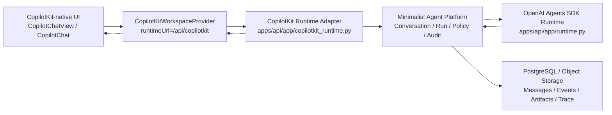

# CopilotKit-native conversation UI with OpenAI Agents SDK runtime

## 背景

Minimalist Agent 已经有两条并行能力：

- 前端已经在应用根部挂载 `CopilotKitWorkspaceProvider`，并把 CopilotKit runtime 指向 `/api/copilotkit`。
- 后端已经有 `copilotkit_runtime.py`，能把 CopilotKit run 请求转换为后端 Agent Conversation / Agent Run，并调用 `runtime_store.execute()`。
- 后端 Agent Runtime 已经由 OpenAI Agents SDK for Python 承担，`runtime.py` 负责创建 SDK `Agent`、选择模型 provider、执行 run、采集 trace，并把结果写回 Agent Run 生命周期。

当前差距在前端：Conversation Workspace 的底部输入栏和消息渲染仍是自研 `form + textarea + transcript`。这会让产品逐渐形成两套聊天心智：一套是 CopilotKit provider/runtime，另一套是 Minimalist 自己维护的 composer 和消息流。后续 attachments、suggestions、tool-call UI、人机确认、前端页面状态共享都会重复建设。

本设计文档确定迁移方向：**前端对话渲染层使用 CopilotKit-native UI 体验，后端 Agent Runtime 使用 OpenAI Agents SDK，Minimalist Agent 平台保留治理、持久化、策略和审计所有权。**

## 目标

- Conversation Workspace 的中央对话体验靠近 CopilotKit-native：消息、输入、streaming、附件入口、suggestions、tool-call rendering 和 custom message rendering 尽量使用 CopilotKit v2 的 UI / hook 模型。
- OpenAI Agents SDK 继续作为唯一后端 Agent Runtime。CopilotKit 不执行后端 Agent，不持有模型凭据，不绕过 Agent Tool Gateway。
- `/api/copilotkit` 是协议 adapter：它只翻译 CopilotKit REST/SSE 请求和 AG-UI 事件，不承载业务治理核心。
- Minimalist Agent 继续拥有 Agent Conversation、Agent Run、Allowed Model Selection、Agent Capability Policy、Run Capability Snapshot、Run Attachment、Artifact、Card Schema Registry、Run Audit、Full Trace。
- 迁移以小步可验证方式完成，不一次性推翻左侧 conversation 导航、右侧 Artifact Preview 或管理员治理能力。

## 非目标

- 不引入 CopilotKit Intelligence 作为 MVP 的 durable thread 后端。
- 不把 CopilotKit 前端工具当作后端工具授权路径。
- 不让 User 在 composer 中启用或禁用 Search、Sandbox、MCP 等能力。
- 不把 Artifact body 嵌入 CopilotKit message；Artifact 仍按引用存储和预览。
- 不把 OpenAI Agents SDK 的 trace 或 Full Trace 暴露给普通 User。

## 分层决策



### CopilotKit owns the frontend interaction surface

CopilotKit should own:

- chat input behavior;
- message rendering shell;
- streaming run state in the chat surface;
- attachment picker experience;
- static or dynamic suggestions;
- custom renderers around messages;
- tool-call display slots;
- browser-side UI-only frontend tools.

CopilotKit should not own:

- model credential resolution;
- Agent Run lifecycle state;
- capability policy enforcement;
- MCP / sandbox / search / page-read authorization;
- Artifact storage;
- Run Audit and Full Trace visibility.

### OpenAI Agents SDK owns runtime execution

OpenAI Agents SDK should own:

- model call orchestration;
- SDK Agent construction;
- SDK-compatible tool integration;
- runtime trace capture;
- sandbox integration where supported by the SDK.

OpenAI Agents SDK should not own:

- User-facing conversation management;
- administrator policy UI;
- authorization decisions outside the resolved Run Capability Snapshot;
- Artifact preview and product-specific card rendering.

### Minimalist Agent owns product governance

Minimalist Agent should own:

- Agent Conversation persistence and list/search/delete/rename;
- Agent Run creation, one-active-run enforcement, cancellation, event log, status;
- Agent Capability Policy and Run Capability Snapshot;
- Model Configuration and Allowed Model Selection validation;
- Agent Tool Gateway;
- Artifact metadata/body storage and preview;
- Card Schema Registry validation;
- Administrator Run Audit and Full Trace.

## Current-state code map

| Area | Current file | Current role |
| --- | --- | --- |
| App provider | `apps/web/src/app/app.tsx` | Wraps protected routes with `CopilotKitWorkspaceProvider`. |
| CopilotKit provider and bridges | `apps/web/src/shared/copilotkit-adapter.tsx` | Configures `/api/copilotkit`, Authorization header, page context, and UI-only frontend tools. |
| Conversation shell | `apps/web/src/features/workspace/conversation-shell.tsx` | Owns sidebar, workspace header, transcript, self-built composer, attachments, artifact inspector. |
| Workspace API | `apps/web/src/features/workspace/workspace-api.ts` | Calls Minimalist `/conversations`, `/runs`, `/run-attachments`, `/artifacts` routes. |
| CopilotKit adapter | `apps/api/app/copilotkit_runtime.py` | Exposes `/copilotkit/info`, `/connect`, `/run`, `/stop`; translates to Agent Conversation / Agent Run. |
| Agent runtime | `apps/api/app/runtime.py` | Uses OpenAI Agents SDK `Agent`, `Runner`, provider config, and trace capture. |
| Run lifecycle | `apps/api/app/agent_run_lifecycle.py` | Queues, starts, completes, fails, or cancels Agent Runs. |

## Target frontend design

### New module: CopilotConversationSurface

Introduce a frontend module under the workspace feature, for example:

```text
apps/web/src/features/workspace/copilot-conversation-surface.tsx
```

Its interface should stay small:

```tsx
type CopilotConversationSurfaceProps = {
  agentId: string;
  threadId: string;
  selectedModelConfigurationId: string | null;
  conversationId: string | null;
  activeRunId: number | null;
  isExistingConversation: boolean;
  onConversationCreated: (conversationId: string) => void;
  onWorkspaceRefresh: (conversationId?: string) => Promise<void>;
  onOpenArtifact: (artifactId: number) => void;
};
```

The module hides:

- `useAgent`;
- `CopilotChatView` slot wiring;
- CopilotKit message submission;
- attachment mapping;
- suggestion configuration;
- tool-call renderer registration;
- run completion refresh behavior.

`ConversationShell` should keep owning:

- left sidebar;
- conversation selection and search;
- new conversation button;
- header, rename, delete, stop run;
- model selection control;
- Artifact inspector state;
- account center and command palette.

This creates a clear seam: `ConversationShell` thinks in product objects; `CopilotConversationSurface` thinks in CopilotKit chat mechanics.

### Why CopilotChatView first

Use `CopilotChatView` for the first migration rather than replacing the whole center with bare `CopilotChat`.

Reasons:

- The current workspace has product-specific controls around the composer, especially Allowed Model Selection and Run Attachment policy.
- Artifact Preview must stay connected to message cards and right inspector.
- Existing tests expect the workspace shell to remain the primary screen.
- `CopilotChatView` lets us adopt CopilotKit-native input/message behavior while keeping Minimalist layout and business controls.

Bare `CopilotChat` can be revisited after Artifact/Card/ToolCall rendering has been adapted.

### Thread mapping

Frontend convention:

- Existing conversation: `threadId = conversation-{conversation.id}`.
- New conversation: generate a client-side temporary thread ID, for example `draft-{uuid}`.

Backend convention:

- `copilotkit_runtime.py` first tries to resolve `threadId` as a backend conversation ID using the existing `conversation-<id>` and numeric mapping rules.
- If no conversation exists, the first CopilotKit run creates a backend Agent Conversation and records the temporary CopilotKit thread mapping.
- `RUN_FINISHED.result` must include `conversationId` so the frontend can refresh and select the created conversation.

Do not use CopilotKit `useThreads` for the MVP conversation list because current runtime is SSE-only, not CopilotKit Intelligence mode.

### Agent mapping

Frontend uses the CopilotKit agent ID advertised by `/api/copilotkit/info`:

- default backend Agent: `default`;
- non-default backend Agent: `agent-{id}`;

Backend keeps `_backend_agent_id()` and `_copilot_agent_id()` as the adapter mapping.

Existing conversations remain bound to the Agent used when created. New conversation Agent Selection may be added later, but the current migration can continue using the active/default Agent.

### Model selection

CopilotKit-native UI does not know Minimalist Agent's Allowed Model Selection. The model choice must be carried as run metadata and enforced on the backend.

Frontend:

- Keep Allowed Model Selection control in the composer/header area.
- Pass `selected_model_configuration_id` through a stable CopilotKit run channel such as `forwardedProps`, `state`, or provider `properties`.
- Existing conversation should pass the conversation's selected model; new conversation should pass the draft selected model.

Backend:

- `copilotkit_runtime.py` extracts `selected_model_configuration_id`.
- For new conversations, resolve and validate it with the Agent's Allowed Model Selection.
- For existing conversations, prefer the conversation's stored model unless the product explicitly allows switching.
- Never trust the frontend model ID without backend validation.

### Attachments

CopilotKit-native attachments should be used for the picker and local UI experience, while storage remains Minimalist-owned.

Phase 1:

- Keep the existing rule that Run Attachments require an existing Agent Conversation.
- Configure CopilotKit attachments with a custom upload handler that calls `/conversations/{id}/run-attachments`.
- Surface uploaded attachment metadata in the chat/composer state.

Phase 2:

- Support attachments on a draft conversation by staging files client-side until the first message creates the backend conversation, then uploading them before queueing the Agent Run.

Backend:

- Store file bodies through existing object-backed file storage.
- Persist Run Attachment metadata against Agent Conversation or Agent Run as currently designed.
- Project only safe attachment metadata into CopilotKit message content or run context.

### Suggestions

Use CopilotKit suggestions as the native empty-state and follow-up mechanism.

Recommended first suggestions:

- Start a new Agent Conversation from the current Agent.
- Summarize the selected Artifact, when an Artifact is open.
- Explain the last failed Agent Run, when the latest run failed.
- Continue from the last assistant response.

Suggestions must not promise unavailable capabilities. They should be derived from Agent Capability Policy and current page state.

### Tool calls

Runtime tool execution remains backend-owned.

Frontend:

- Register display renderers with `useRenderTool` or `useDefaultRenderTool`.
- Use renderers for progress/result cards only.
- UI-only `useFrontendTool` may change local UI state, such as opening an Artifact or focusing a conversation.

Backend:

- Agent Tool Gateway remains the only route for MCP, sandbox, search, page-read, file access, and other external capabilities.
- Tool Call records remain persisted and auditable.
- CopilotKit frontend tools must not mutate backend policy or execute privileged tools.

### Artifacts and cards

Artifact and Card Rendering should become CopilotKit custom message renderers, not a parallel transcript system.

Frontend:

- Wrap existing `ConversationCardView` and Artifact Reference UI as custom renderers.
- Keep right-side Artifact Preview as the inspection surface.
- Opening a card should call `onOpenArtifact(artifactId)` and leave the conversation active.

Backend:

- Continue validating cards through Card Schema Registry.
- Continue storing Artifact body by reference.
- Emit enough message metadata for the renderer to identify Artifact References and cards without embedding large payloads.

### Cancellation and one-active-run enforcement

Frontend:

- CopilotKit input should expose Stop Run while an Agent Run is active.
- Stop Run should call the backend cancellation path, either through CopilotKit `/stop/{threadId}` or the existing Minimalist `/runs/{id}/cancel` route.

Backend:

- Maintain one-active-run-per-conversation enforcement.
- Persist cancelled status and preserve already emitted messages, tool calls, artifacts, and trace fragments.

### Stream resume and event logs

CopilotKit chat streaming is the live interaction surface. Minimalist Agent's Agent Run Event Log remains the durable recovery source.

Initial migration:

- CopilotKit `/connect` can return a snapshot of persisted conversation messages.
- On page refresh, `ConversationShell` still loads `/conversations` before mounting the chat surface.

Later migration:

- Extend `/connect` and event translation to cover process summaries, tool calls, artifacts, cards, and resumable event positions.
- Keep AG-UI SSE as the Agent Event Protocol boundary.

## Target backend adapter design

### Adapter responsibilities

`apps/api/app/copilotkit_runtime.py` should:

- authenticate the local account;
- advertise enabled backend Agents in `/copilotkit/info`;
- map CopilotKit `agentId` to backend Agent;
- map CopilotKit `threadId` to backend Agent Conversation;
- extract the latest user message;
- extract selected model metadata;
- create an Agent Conversation when a new thread runs for the first time;
- queue an Agent Run;
- invoke the existing runtime execution path;
- translate the resulting Agent Run state back to CopilotKit/AG-UI events.

It should not:

- directly call model providers;
- own capability policy;
- own artifact storage;
- expose Full Trace;
- become a second Agent Runtime.

### Runtime responsibilities

`apps/api/app/runtime.py` should remain the OpenAI Agents SDK runtime adapter.

It should:

- resolve the run's selected Model Configuration from the Run Capability Snapshot;
- resolve credentials through the Secret Vault / environment reference mechanism;
- create the OpenAI Agents SDK `Agent`;
- execute with `Runner`;
- capture SDK trace metadata;
- write success/failure through Agent Run lifecycle.

It should not:

- know about CopilotKit UI components;
- parse CopilotKit request shapes;
- own frontend thread mapping.

## Migration plan

### Phase 0: Documentation and contracts

- Add this design document.
- Update ADR-0041 to explicitly say CopilotKit-native UI is the frontend conversation surface.
- Update ADR-0003 to explicitly say OpenAI Agents SDK remains the backend runtime and CopilotKit does not replace it.
- Add tests around the existing adapter contract before UI migration.

Verification:

- Docs link cleanly.
- Current tests remain unchanged.

### Phase 1: Provider and style readiness

- Import `@copilotkit/react-core/v2/styles.css` once in the frontend entry or provider module.
- Ensure `CopilotKitWorkspaceProvider` keeps:
  - `runtimeUrl="/api/copilotkit"`;
  - Authorization header;
  - `credentials="same-origin"`;
  - `useSingleEndpoint={false}`.
- Expand test mocks for `CopilotChatView`, `CopilotChatInput`, and relevant hooks.

Verification:

- `copilotkit-provider.test.tsx` confirms runtime URL and auth headers.
- Typecheck passes.

### Phase 2: Backend selected model support for CopilotKit runs

- Extend `CopilotKitRunRequest` parsing to accept selected model metadata.
- Validate selected model against Agent Allowed Model Selection.
- Ensure new CopilotKit-created conversations store the selected model.
- Ensure existing conversations reject Agent mismatch and preserve stored model.

Verification:

- `test_copilotkit_runtime.py` covers selected model success, invalid model rejection, and conversation creation with selected model.
- `test_agent_runtime.py` still proves OpenAI Agents SDK runtime uses the run snapshot model configuration.

### Phase 3: CopilotConversationSurface behind a feature seam

- Introduce `CopilotConversationSurface`.
- Render it inside the existing central conversation area.
- Keep the old transcript/composer temporarily available behind a local fallback flag or remove only after tests are updated.
- On run finish, refresh workspace and select created conversation.

Verification:

- Conversation shell tests assert CopilotKit-native chat surface appears.
- Sending a message uses `/api/copilotkit/agent/{id}/run`.
- Backend still creates Agent Run and assistant message.

### Phase 4: Attachments and suggestions

- Wire CopilotKit attachments to `/run-attachments`.
- Keep phase-1 limitation that attachments need an existing conversation.
- Add static suggestions derived from current page state.

Verification:

- Existing attachment tests continue to pass.
- New tests cover upload failure, invalid type/size, and suggestion click behavior.

### Phase 5: Artifact, card, and tool-call rendering

- Register custom message renderers for Artifact Reference and Card Rendering.
- Register tool-call renderers for backend Tool Call summaries.
- Keep Artifact Preview rail unchanged.

Verification:

- Artifact Preview tests continue passing.
- Card rendering contract tests still validate schema allowlist behavior.
- Tool Call display does not imply frontend-side tool execution.

### Phase 6: Remove old composer and transcript

- Remove the self-built `backend-chat-form` path.
- Rename misleading CSS classes such as `.embedded-copilot-chat` if they no longer reflect real structure.
- Update docs and tests to use CopilotKit-native terms.

Verification:

- Frontend tests pass.
- Backend tests pass.
- Manual smoke test:
  - create conversation;
  - send CopilotKit-native message;
  - run executes through OpenAI Agents SDK;
  - open Artifact Preview;
  - stop active run;
  - inspect Run Audit.

## Test strategy

Backend tests:

- `/copilotkit/info` advertises enabled backend Agents.
- `/copilotkit/agent/{id}/connect` returns snapshot events for existing conversations.
- `/copilotkit/agent/{id}/run` creates Agent Run and invokes `runtime_store.execute()`.
- selected model metadata is validated against Agent Allowed Model Selection.
- Agent mismatch returns conflict.
- stop cancels an active Agent Run.

Frontend tests:

- Provider uses `/api/copilotkit` with Authorization header.
- Conversation shell renders CopilotKit-native chat surface.
- New conversation message creates backend conversation and refreshes sidebar.
- Existing conversation message uses `threadId=conversation-{id}`.
- model selector passes selected model metadata.
- attachment upload uses Minimalist `/run-attachments`.
- Artifact/Card custom renderer opens right inspector.
- UI-only frontend tools do not call privileged backend routes.

Smoke test:

- Login as approved User.
- Open `/app/conversations`.
- Send a message through CopilotKit-native composer.
- Confirm the backend Agent Run uses OpenAI Agents SDK runtime.
- Confirm messages persist after refresh.
- Confirm Artifact Preview and Run Audit entry points remain visible.

## Risks and mitigations

| Risk | Mitigation |
| --- | --- |
| CopilotKit message model cannot directly represent Minimalist Artifact/Card metadata. | Use custom message renderers and keep backend message metadata small and explicit. |
| Model selection is lost when moving to CopilotKit-native input. | Carry selected model in run metadata and enforce it server-side. |
| Attachments become base64-inline instead of object-backed. | Always use custom upload handler for Minimalist `/run-attachments`; disable default inline strategy where needed. |
| Frontend tools accidentally bypass backend governance. | Restrict `useFrontendTool` to UI-only operations; keep Tool Gateway as only privileged execution path. |
| `useThreads` is assumed to replace conversation list. | Keep Minimalist conversation API as source of truth until adopting CopilotKit Intelligence is a deliberate future decision. |
| Existing tests are coupled to `后端对话面板`. | Update tests to assert product behavior rather than the old implementation label. |

## Open questions

- Should existing conversations allow model switching after creation, or should model selection remain fixed per conversation?
- Should draft attachments be supported before the first message, or should MVP continue requiring an existing Agent Conversation?
- Which CopilotKit event shape should carry Artifact/Card metadata in the first custom-renderer slice?
- Should Stop Run use CopilotKit `/stop/{threadId}` exclusively, or keep the visible UI wired to Minimalist `/runs/{id}/cancel`?

## Success criteria

- Users experience the central chat as CopilotKit-native, including input, streaming, attachment affordance, and suggestions.
- Backend Agent Runs continue to execute through OpenAI Agents SDK.
- Agent Capability Policy, Allowed Model Selection, Tool Gateway, Artifact storage, Run Audit, and Full Trace remain backend-owned.
- The left conversation list and right Artifact Preview continue to work across refreshes.
- The old self-built chat form is removed or no longer the primary path.
